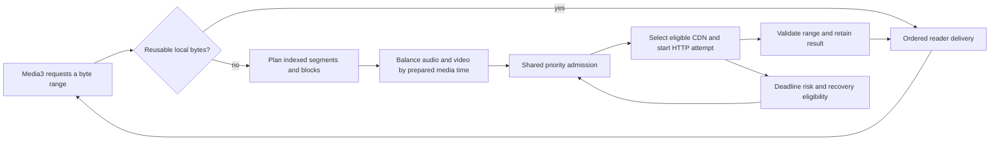

# CDN downloader: current design and documentation

This is the entry point for the fork's optional parallel VOD downloader. It covers
the current source, including shared rescue admission and observed transfer counters.
It does not imply that every TV has installed the latest build. Live playback uses
its existing independent path.

## Where to read and update

| Document | Purpose |
| --- | --- |
| [State and ownership design](CDN-state-design.md) | Current scheduling, speed evidence, readiness, transport admission and memory rules. Update this when changing those policies. |
| [Transfer accounting](CDN-transfer-accounting.md) | Meaning of counters, seek/replay behavior, overhead categories and the boundary between measurements and estimates. |
| [Fork maintenance](CDN-fork.md) | User options, upstream/reference history, network integration, build/deployment procedures and accumulated implementation notes. Older baseline figures are not additional current limits. |

When changing policy, update its owning document and focused regression tests in
one change. Do not append a new rule while leaving a contradictory current rule
elsewhere. Label proposed behavior explicitly; a diagram or formula is not proof
that a runtime path implements it.

## Pipeline and independent budgets

Media3 decides what to request and when to load. The downloader prepares ranges
for those requests; it cannot force Media3 to consume them. Scheduled horizons may
include completed future blocks beyond a gap. Delivery itself never skips a gap.

Three constraints are separate:

- **HTTP capacity:** one N-slot controller; ordinary downloads, probes and
  exploration share N−1 slots. Recovery has priority for newly available capacity.
- **Memory capacity:** copy-inclusive reservations and retained array ownership
  share the adaptive budget. An available worker is not permission to allocate.
- **Playback usefulness:** immediate demand, track balancing and media-time order
  determine which eligible work should use the available capacity.

Configured concurrency is a ceiling, not a promise to keep every slot occupied.
Empty slots must be explainable as lack of requested work, admission priority,
CDN eligibility, memory shortage, or Media3's actual loading decision.

## CDN candidates and measurements

Candidates combine Bilibili's signed playback base/backup URLs with a bundled list
adapted from thread-ripper: eight mainland hosts or four overseas hosts. Compatible
URLs keep their original path and signed query while the authority is replaced.
Original API URLs remain candidates. Probing measures this pool; it does not discover
new hostnames or update the bundled list remotely.

`CdnResolver` keeps host health/load and representation-specific speed evidence.
Selection uses penalty-adjusted per-block speed, not aggregate bandwidth. Feasible
idle routes are preferred; feasible busy routes or the earliest predicted completion
remain fallbacks. Cooldown recovery is bounded, not a blanket bypass for speculation.
See the state design for media-position weighting and seek evidence transitions.

## Segments, blocks and startup

A media segment is an indexed SIDX range; a block is a downloader partition of it.
The default minimum block size is 512 KiB. For a bounded planning range of B bytes,
the partition count is `min(workers, max(1, floor(B / minimum)))`, with balanced pieces.
Short ranges can be smaller than the selected minimum. Large segments can first be
split into bounded planning spans; do not apply the formula to an unlimited file request.
Startup probes use a separate 64 KiB head range.

Startup tests video and audio independently. Audio initially receives at least one
probe, based on a quarter of configured slots; freed capacity first helps audio reach
its intermediate result target, then helps either track. Validated-result targets
and candidate exhaustion bound probing. Media3 readiness ends redundant startup
probing. Ordinary required data can proceed while probes remain active.

Ordinary exploration targets the farthest eligible block. Large blocks can use two
halves; smaller blocks use whole-block exploration. Protected measurements may
continue after a rescue wins, subject to their timeout and shared resource limits.
They are not exempt from memory accounting or global HTTP admission.

## Rescue and cache invariants

- Only one session blocking range owns rescue escalation. Normal rescue and
  pre-deadline/buffering escalation share `min(N, max(2, floor(N/2)))` total attempts,
  including the original and attempts that have not actually exited after cancellation.
- Wait for workers. Never cancel another download solely to acquire its HTTP slot.
- Preserve the observation delay, suffix-only rescue, validated stitching, small-tail
  wait, route penalties and gradual recovery. A viable running backup suppresses
  unnecessary additional discovery copies.
- When recovery cannot allocate, reclaim eligible delivered/abandoned data first,
  then farther work and, if necessary, unpinned unread cache. Protect current reader
  demand and the recovery target. Reclaim for the next attempt only.
- Canceling is not freeing memory. Wait for actual owners to release before selecting
  more victims; a pending recovery claim prevents ordinary refill stealing that space.
- Restore retired ranges to the ordered plan. Revoked late results cannot repopulate
  them. Seek reuse follows actual retained data rather than historical completion.
- A memory-blocked immediate read has a bounded capacity failure through existing
  Media3 error handling. This repair adds no automatic player reset.

## Diagnostics and interpretation

The progress display combines retained downloader ranges and Media3 availability
estimates. Green is a current availability claim, not a cumulative download history.
Seek invalidates player-side estimates; actual retained cache remains reusable.
Worker colors identify CDNs; probe/rescue/issue underlines record distinct events.
The visual updater is throttled to ten updates per second.

The CDN panel reports segment/block sizes, route evidence and confidence, while
charts show aggregate network traffic separately from scheduling speed estimates.
The overhead pie uses exact per-body-copy disposition when the session provenance
sampler is attached. Approximate labels remain only for the legacy fallback without
that sampler. Cache replay does not count another use; a fresh download can. See
[transfer accounting](CDN-transfer-accounting.md) for the boundary and raw counters.

For a reproducible stall, enable playback download logging or the persistent buffering
capture in cache settings. Correlate `session_capacity`, reader demand, route-selection
reason, admission wait, memory samples and Media3 load-control decisions. A low worker
count alone does not establish a scheduler bug. Never include signed media URLs,
cookies or media payloads in diagnostics.

## Code and regression map

All paths below are relative to `player/src/main/kotlin/dev/frost819/newbv/player/`.

| Responsibility | Implementation | Focused tests under `player/src/test` |
| --- | --- | --- |
| Reader lifecycle, dispatch, stitching and seek reuse | `download/ParallelDownloadSession.kt` | `ParallelDownloadSessionTest`, `SuffixRescueTest`, `SeekReuseTest` |
| Shared HTTP priority and leases | `download/HttpAdmissionController.kt` | `HttpAdmissionControllerTest` |
| Rescue escalation | `download/EmergencyRescuePolicy.kt` | `EmergencyRescuePolicyTest`, `RecoveryExplorationTest` |
| Adaptive reservations and shared array ownership | `download/DownloadMemoryBudget.kt`, `download/RangeBlockCache.kt` | `DownloadMemoryBudgetTest`, `RangeBlockCacheTest`, `ProtectedRangeRaceTest` |
| Track ordering and startup | `download/ReadAheadAdmission.kt`, `download/StartupProbePolicy.kt` | `TrackDispatchTest`, `ReadAheadAdmissionTest`, `StartupProbePolicyTest` |
| CDN choice and evidence | `download/CdnResolver.kt`, `download/BlockSpeedWindow.kt` | `CdnExplorationTest`, `BlockSpeedWindowTest`, `CooldownRecoveryTransportTest` |
| Exact copy disposition and raw transfer observations | `download/ExactTransferLedger.kt`, `download/DownloadMonitor.kt`, `download/AttemptAccounting.kt` | `ExactTransferLedgerTest`, `DownloadTransferMeasurementsTest`, `DownloadTransferStatsTest`, `AttemptAccountingTest` |
| Player loading observations | `impl/exo/MeasuredLoadControl.kt` | `MeasuredLoadControlTest` |

Use compiler/tests, Android lint, coverage and bytecode references to check that a
policy is actually wired into execution. R8 usage reports also include generated
members and inlined constants; their removal alone is not evidence of dead policy.
Device testing is still required for real TV memory pressure and network timing.
